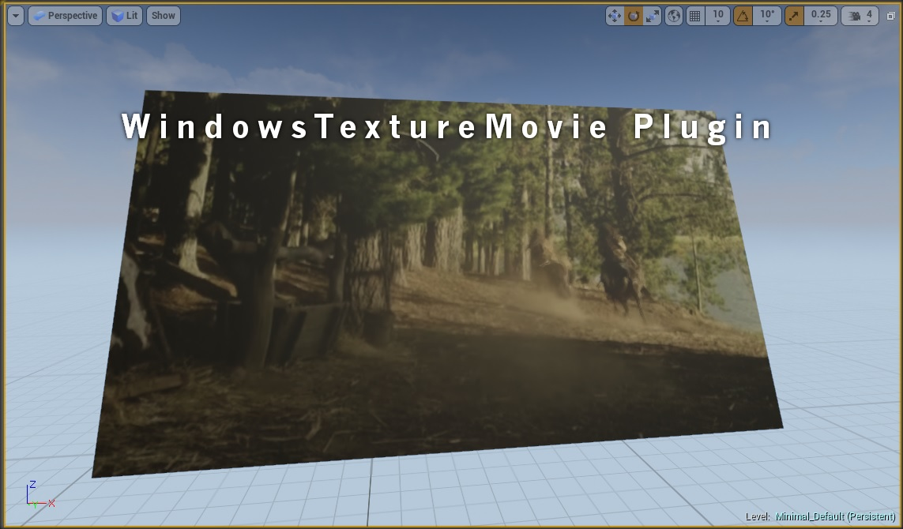

TextureMovie Plugin for Unreal Engine 4
========================================

Adds the ability to import AVI/WMV videos and use them as textures in UE4. Currently only for Windows as it uses the Media Foundation as the backend for playing the videos. Currently working on a cross platform solution.

Current version: **v0.0.1**

Installation
------------

1. Download the source code and place into /Engine/Plugins/Runtime directory (or your own projects plugin directory) and compile.
1. Run editor, you should now have the ability to import AVI/WMV videos.

Known Issues
------------

1. Option "Reset on Last Frame" currently does nothing.
1. There is no way to stop or play the video during gameplay.

Legal info
----------

Unreal® is a trademark or registered trademark of Epic Games, Inc. in the United States of America and elsewhere.

Unreal® Engine, Copyright 1998 – 2014, Epic Games, Inc. All rights reserved.

